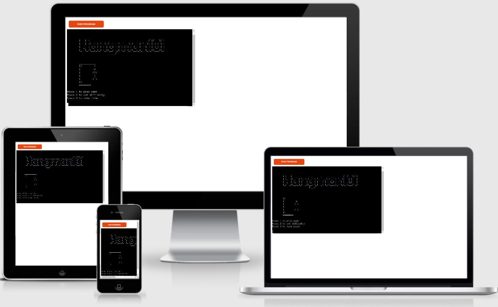
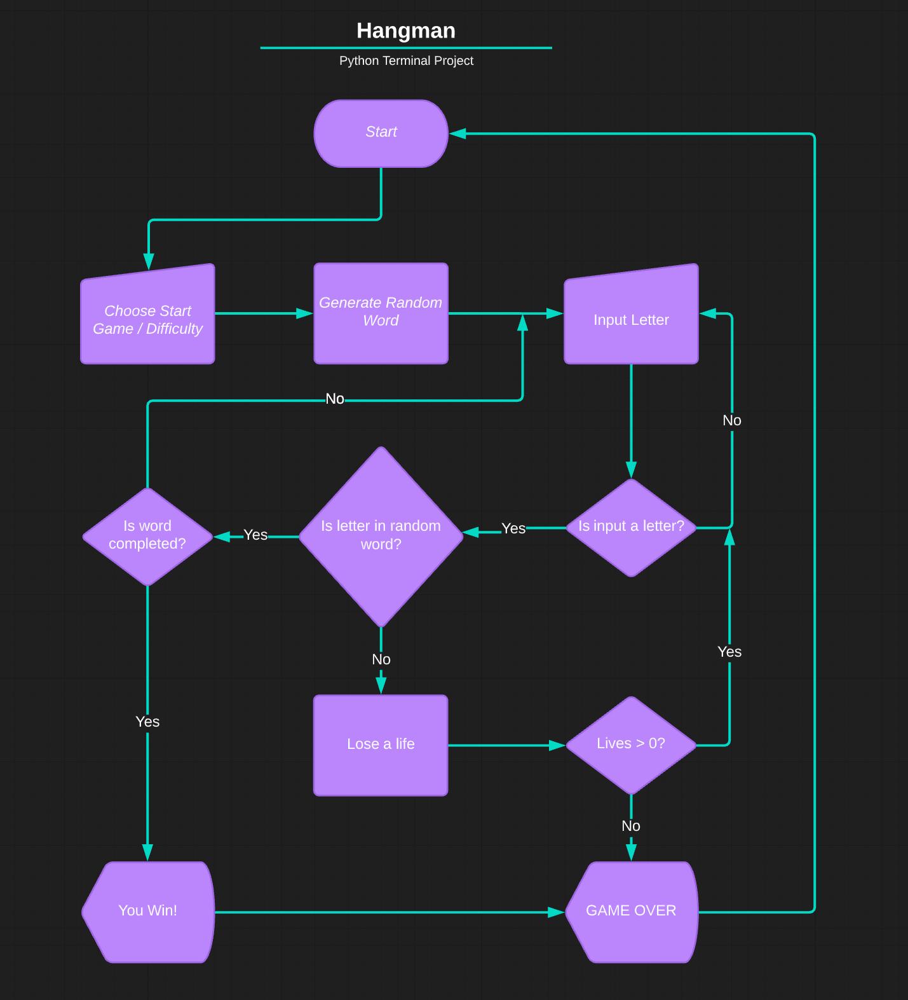
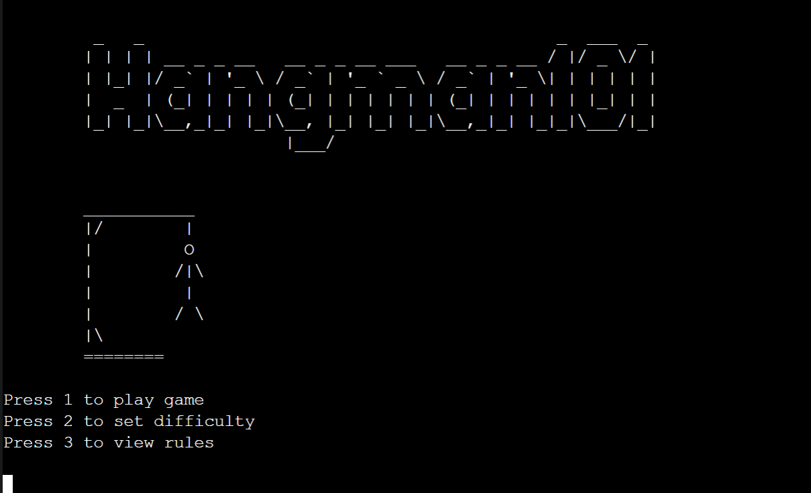
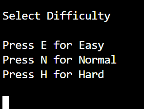
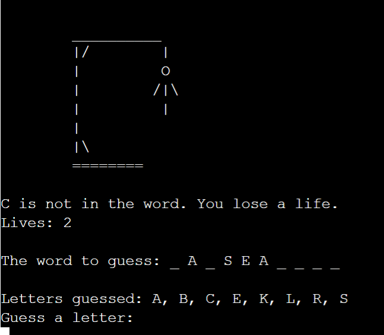
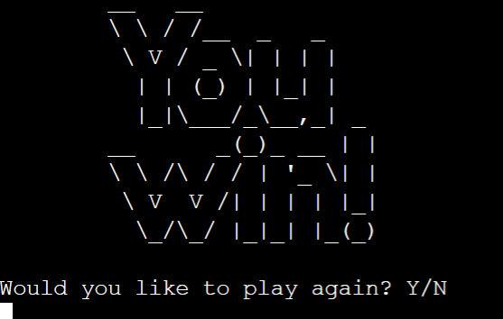
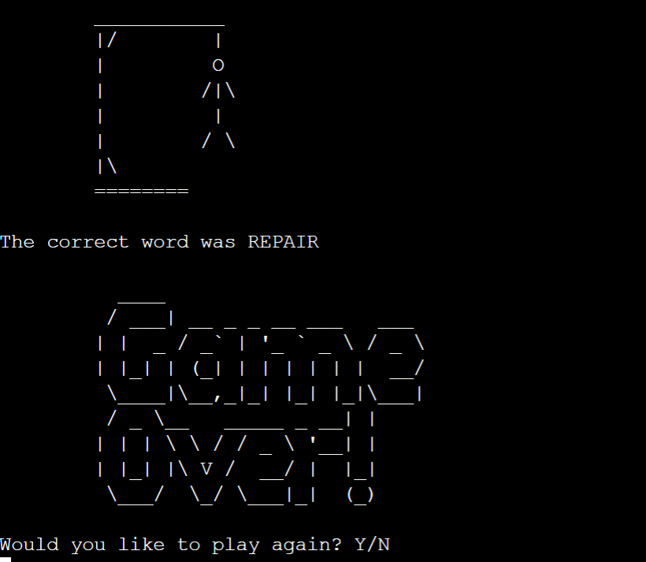

# **Hangman101**
Hangman101 is a Python terminal game, which runs on the Code Institute mock terminal on Heroku.
Users can try to guess the word by inputting letters until they either guess the word or it is game over. 

[Hangman101](https://hangman101.herokuapp.com/) - You can view the live site here. 

 

## **Table of Contents**
 * [**How to Play**](#how-to-play)
 * [**Planning Stage**](#planning-stage)
   * User Goals
   * Using FlowCharts
 * [**Features**](#features)
 * [**Bugs**](#bugs)
   * Fixed Bugs
 * [**Resources**](#resources)

## **How to Play**
Players play Hangman101 by inputting commands into the mock terminal. The aim of the game is to guess the hidden word, represented with _ _ _ _ to show players how many letters are in the word. As the player corrrectly guesses letters, the _ are replaced with the correct letter. If a player puts in an incorrect command, an error message displays and the player is asked to resubmit their choice. 
The game is over either when the player has correctly guessed the word or they have run out of lives. 

## **Planning Stage**

### **User Goals**
To build a terminal version of Hangman for a developer to use in an IDE environment whilst taking a break from coding.
 * The game should be easy to play
 * The game should be fun to play
 * There should be a level of challenge for the user to keep them coming back

 ### **Using FlowCharts**
 During the planning process I thought about the basic steps needed to play a game of hangman and drew a basic flowchart to help guide my coding process whilst developing the game. 
  * Where were inputs from the user needed?
  * How would I deal with invalid inputs?
  * How would I deal with incorrect tries?
  * Were there any logic errors that could break the loop of the game?

 

 ## **Features**

 ### **Existing Features**
* Game Menu
  * Can select to start game
  * Can change difficulty
  * Can view how to play the game

* Set Difficulty
  * Easy - 10 lives
  * Normal = 7 lives
  * Hard = 5 lives

* View Game Rules

 * Random word generations
   * A function randomly generates a word from a list of 500 words.
   * The player can not see what the word is but can see how many letters are in the word denoted by _ _ _ _ _ 

 

 * Lives with graphical representation
   * The user has a certain amount of lives before it is game over.
   * This can be seen whilst playing the game.
   * It is also represented by a image of the hangman being built as each life is lost.
   * You can get more lives by changing the difficulty.

 

* Game Over Screens
 * A custom screen for winning the game and for game over. 
 * Users can choose whether to restart the game or go back to the main menu.

 

 

### **Bugs**

## **Fixed Bugs**
* Bug: When implementing hangman graphics, lives left did not correspond to amount of stages left in hangman.
  * Fix: Due to lists iterating from 0, set lives displayed to user as lives + 1 and also adjusted the game over setting for lives >=0
* Bug: When testing hangman graphics, the bottom graphic was shifted over to the right.
  * Fix: Replaced \ with double \\\\ make \ print to the terminal. 
* Bug: When on last life, letters guessed and amount of lives fail to show on terminal.
  * Fix: Set lives to lives >=0 at end of while loop to ensure messages display correctly.
* Bug: Hangman graphic not displaying on game over.
  * Fix: Add in additional stage of hangman graphic. Remove lives + 1 from script, set game over criteria back lives > 0. A more elgant fix for the problem above.
* Bug: When selecting view rules. After returning to the main window, if you selected play game it would go to the difficulty menu
  * Fix: Called main() in game rules rather that initialise_game()
* Bug: Error message too long causing last letter to wrap to following line.
  * Fix: Split up error string and put "Please try again" to a new line.

### **Resources**
 * [Random Word Generator](https://www.randomlists.com/random-words) - to generate a random list of 500 words for the game.
 * [Python Hang Man tutorial](https://github.com/kiteco/python-youtube-code/tree/master/build-hangman-in-python) - inspiration on how to build a hang man game. Whilst I have attempted to do my own thing, and greatly expand on the initial example, some code may be similar. 
 * [ASCII Art Generator](https://patorjk.com/software/taag/#p=display&f=Standard&t=Hangman101) - for creating word art for game title and game over screens.